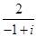
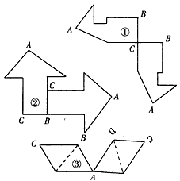

# PR53 Phase 4: 截断逻辑、EOS 传递与 `max_new_tokens` 到底是怎么一起工作的

本文专门回答 [PR53_FOLLOWUP_CHECKLIST.md](./PR53_FOLLOWUP_CHECKLIST.md) 里的 Phase 4 问题：

> 修复截断的逻辑，eos token是否正确传入，max_new_tokens是否应该设置比较大

这份文档不只讲“某个参数该不该调”，而是把下面几件事一次性讲清楚：

1. 当前 LightRFT 里到底有几层“截断 / 停止”控制。
2. `eos_token_id` / `pad_token_id` 到底有没有正确传入本地 HF rollout。
3. 为什么你之前跑 `~/URSA-MATH` 的离线推理时，会感觉它是“一次性自然写完整篇”。
4. 为什么在线 RL 这里反而必须要有长度边界，而且不能只靠“放大 `max_new_tokens`”解决。
5. 这次真实长跑 run 里，哪些现象说明现在主要是在靠强停和后处理兜底。

本文聚焦的真实运行对象是：

- experiment: `default-real-online-hansbug-eval5`
- W&B run name: `default-real-online-hansbug-eval5-20260330_235638`
- run dir: `results/default-real-online-hansbug-eval5/default-real-online-hansbug-eval5-ep10-kl0.001-lr1e-6-20260330_235638`
- log: `rft_logs/default-real-online-hansbug-eval5/node0_20260330_235638.log`
- 对照实现: `~/URSA-MATH`

## 太长不看

当前 Phase 4 不是单一“截断 bug”，而是三层控制叠加：外层训练想生成到 `3072`，本地 HF rollout 又被 `local_hf_max_new_tokens=512` 硬卡住；写到 `†Answer:` 后，`structured_answer_stop` 会强行把下一步改成 EOS；生成完还会用 `sanitize_math_prm_response_text()` 把答案后的尾巴裁掉。长跑 run 里既有 `step80_exp6_sample0_img0` 这种 511 token 撞墙、连 `†Answer:` 都没写到的样本，也有整批 `127/128` 条在答案后被二次裁尾。结论：在线 RL 需要长度边界，但当前主要问题不是“没截断”，而是自然停机不稳，靠强停和后处理在兜底。

## 一页结论

- `eos_token_id` 和 `pad_token_id` 已经正确传入本地 HF `generate()`；当前主矛盾不是“EOS 没传进去”。
- 真实 rollout 上限不是 `generate_max_len=3072`，而是 `min(3072, local_hf_max_new_tokens=512)=512`。
- `structured_answer_stop` 已经真实生效，而且会大量强制 EOS；这说明很多样本不是自然停在 `†Answer:`。
- `sanitize_math_prm_response_text()` 的确在大规模事后裁尾；这不是“轻微美化”，而是高比例强修剪。
- 所以 Phase 4 不能只回答“要不要把 `max_new_tokens` 调大”。更准确的说法是：
  - 在线 RL 必须保留硬长度边界。
  - 当前不应该主要依赖“答案后强停 + 事后裁尾”。
  - 单纯把 cap 放大，只能缓解一部分“答案前撞墙”，修不掉“答案后继续乱写”和“格式偏离导致 stop 条件失效”。

## 1. 先把“为什么需要截断”说透

你之前跑 `~/URSA-MATH` 时，会感觉模型是“一次性完整写完”。这个观察没错，但那是**离线推理**视角，不是**在线 RL rollout**视角。

在线 RL 这里，长度边界不是为了好看，而是系统约束：

1. 每个 prompt 不是只采 1 条，而是采 `n_samples_per_prompt=8`。
2. 当前长跑 run 的 `rollout_batch_size=128`，也就是一轮 collect 会生成 `128 x 8 = 1024` 条回答。
3. 每条回答后面还要再跑 reward model、logprob、KL、advantage、replay buffer。
4. 如果不把长度控住，rollout 时间、显存占用、训练节奏都会爆。

这不是我主观猜，而是当前 run 的本地 log 已经把代价写出来了。

### 摘录：`node0_20260330_235638.log`

```text
local_hf_max_new_tokens=512
...
[StrategyINFO 03-31 00:20:27]  step 0 generate length:  {'total_samples': 1024, 'min_length': np.int64(474), 'max_length': np.int64(512), 'mean_length': np.float64(511.8359375), 'median_length': np.float64(512.0), 'percentiles': {50: 512, 80: 512}}
[StrategyINFO 03-31 00:20:28]  ***Rollout engine generation time (global max): 1231.3240s
```

这段信息说明：

- 第 0 个 full batch 一共生成了 `1024` 条样本。
- 平均长度已经是 `511.84 / 512`，几乎全体贴着 cap 走。
- 光 rollout generation 就用了 `1231s`，也就是大约 `20.5` 分钟。

所以如果你把本地 HF cap 从 `512` 一口气放到 `2048`，而模型仍然有“顶着 cap 写到底”的倾向，那么 rollout 时长很容易近似再放大到当前的数倍。这里不是说一定严格线性翻四倍，但从工程角度看，风险非常大。

### 论文里为什么也强调这个问题

`URSA` 论文自己已经说过，在线 RL 里如果直接把 PRM 的标量过程分数当目标，模型会出现 reward hacking 和长度偏置。

### 摘录：`~/URSA-MATH/paper.md`

```text
We observe two highly significant conclusions from Figure 4:
(i) High susceptibility to reward hacking ...
(ii) PRM’s length bias in rewarding. We observe a trend where increased training
leads to shorter model responses and fewer reasoning steps.
```

```text
This results in the PRM conservatively rewards the later stages of a reasoning rollout,
thereby encouraging the MLLM towards more passive reasoning ...
```

```text
when it occurs, we apply a reward penalty γ to rollouts with correct results.
This both differentiates the learning value of outcome-correct rollouts and ...
circumvents the impact of PRM’s length bias in rewarding.
```

这段话的含义不是“论文主张无限放长文本”。相反，它在说：

- online RL 天然就怕**长度和奖励耦合失真**
- 因此 rollout 必须是**可控长度、可控格式、可控终止条件**
- PS-GRPO 解决的是“过程分数怎么用”，不是“输出无限长也没关系”

所以，“为什么需要截断”的正确答案不是一句“因为实现偷懒”。更准确地说：

- **在线 RL 必须有 hard cap**
- **但当前不应该主要靠 post-hoc 截尾来伪装自然停止**

## 2. 当前实现其实是三层控制，不是一层

当前 LightRFT 的 Phase 4 相关逻辑，至少有三层：

1. **硬长度上限**：`max_new_tokens` 与 `local_hf_max_new_tokens`
2. **结构化强停**：`structured_answer_stop`
3. **事后清洗**：`sanitize_math_prm_response_text()`

如果不把这三层拆开，很容易误判成“只要改一个参数就能修好”。

### 2.1 第一层：外层想生成 `3072`，但本地 HF rollout 会再被硬卡到 `512`

训练入口传给 trainer 的 `max_new_tokens` 确实是 `args.generate_max_len`。

### 摘录：`examples/math_prm/train_colocate.py`

```python
# for GPT generation
do_sample=True,
max_new_tokens=args.generate_max_len,
max_length=args.max_len,
temperature=args.temperature,
top_p=args.top_p,
top_k=args.top_k,
repetition_penalty=args.repetition_penalty,
no_repeat_ngram_size=args.no_repeat_ngram_size,
pad_token_id=tokenizer.pad_token_id,
eos_token_id=tokenizer.eos_token_id,
```

而脚本默认值是：

### 摘录：`examples/math_prm/run_grpo_math_prm_ursa_8b.sh`

```bash
GENERATE_MAX_LEN="${GENERATE_MAX_LEN:-3072}"
...
if [[ "${ENGINE_TYPE}" == "hf" ]]; then
    ...
    LOCAL_HF_MAX_NEW_TOKENS="${LOCAL_HF_MAX_NEW_TOKENS:-512}"
fi
```

真正到了 `FastExperienceMaker` 的 HF rollout 分支，又会做一次 clamp：

### 摘录：`lightrft/trainer/fast_exp_maker.py`

```python
max_new_tokens = generate_kwargs.get("max_new_tokens", 1024)
local_hf_max_new_tokens = int(getattr(config, "local_hf_max_new_tokens", 0) or 0)
if local_hf_max_new_tokens > 0:
    max_new_tokens = min(max_new_tokens, local_hf_max_new_tokens)
sampling_params = dict(
    ...
    max_new_tokens=max_new_tokens,
    ...
)
```

所以当前这条链路里的真实关系是：

```text
训练入口希望 max_new_tokens = 3072
    ↓
HF rollout 本地再取 min(3072, 512)
    ↓
真实 rollout 上限 = 512
```

这已经直接回答了 Phase 4 的一个核心问题：

- **不是现在根本没有把 `max_new_tokens` 设大。**
- **而是本地 HF rollout 又额外套了一层更小的 cap。**

### 2.2 第二层：看到 `†Answer:` 后，不是等模型自己停，而是 logits processor 会强行推 EOS

当前只有当 label 全是 `math_prm` / `math_prm_combined` / `math_psgrpo` 这类 structured label 时，HF rollout 才会打开 `structured_answer_stop`。

### 摘录：`lightrft/trainer/fast_exp_maker.py`

```python
structured_answer_stop = bool(all_labels) and all(is_math_prm_structured_label(label) for label in all_labels)
if config.engine_type == "hf":
    sampling_params["structured_answer_stop"] = structured_answer_stop
```

到了 `StrategyBase` 的本地 HF rollout，`structured_answer_stop=True` 就会挂上 `_StructuredAnswerEosLogitsProcessor`：

### 摘录：`lightrft/strategy/strategy_base.py`

```python
structured_answer_stop = sampling_params.get("structured_answer_stop", False)
...
logits_processor = None
if structured_answer_stop:
    logits_processor = LogitsProcessorList(
        [
            _StructuredAnswerEosLogitsProcessor(
                self.inference_tokenizer,
                padded_input_ids.size(1),
                eos_token_id,
            )
        ]
    )
```

这个 processor 不是温柔提醒，而是真的会把 stop 的行强制改成“只能出 EOS”：

### 摘录：`lightrft/strategy/strategy_base.py`

```python
if not torch.any(stop_mask):
    return scores

self._stats["forced_eos_rows"] += int(stop_mask.sum().item())

forced_scores = scores.clone()
forced_scores[stop_mask] = torch.finfo(forced_scores.dtype).min
forced_scores[stop_mask, self.eos_token_id] = 0
return forced_scores
```

也就是说，只要它判定“该停了”，就会：

- 把这一行其他 token 的 logit 全部压到极小
- 只给 `eos_token_id` 留出口

这已经不是“自然结束”，而是**运行时强停**。

### 2.3 第三层：即使生成结束了，后面还会再做一次 `sanitize`

rollout 结束后，`FastExperienceMaker` 还会统一跑一遍 structured output 的事后清洗：

### 摘录：`lightrft/trainer/fast_exp_maker.py`

```python
all_outputs = self._sanitize_structured_math_prm_outputs(all_outputs, all_labels)
```

### 摘录：`lightrft/trainer/fast_exp_maker.py`

```python
original_text = self.tokenizer.decode(original_ids, skip_special_tokens=False)
cleaned_text = sanitize_math_prm_response_text(original_text)
if cleaned_text == original_text:
    continue
...
outputs[idx].output_token_ids = cleaned_ids
sanitized += 1
trimmed_token_counts.append(len(original_ids) - len(cleaned_ids))
```

`sanitize_math_prm_response_text()` 本身做的事情也不是小修小补，而是明确裁掉答案行后面的尾巴、重复 marker、过长 answer：

### 摘录：`lightrft/utils/math_prm_output.py`

```python
def sanitize_math_prm_response_text(response_text: str) -> str:
    normalized_text, answer_line, _ = _extract_answer_line(response_text)
    marker_index = normalized_text.find(MATH_PRM_ANSWER_MARKER)
    if marker_index < 0:
        return normalized_text

    prefix = normalized_text[: marker_index + len(MATH_PRM_ANSWER_MARKER)]

    cutoff = find_math_prm_tail_cutoff(answer_line)
    if cutoff is not None:
        answer_line = answer_line[:cutoff]
    ...
    return prefix.rstrip() if not answer_line else f"{prefix} {answer_line}".rstrip()
```

而 stop heuristic 则会在多种条件下认为“答案已经够了，该停了”：

### 摘录：`lightrft/utils/math_prm_output.py`

```python
if has_more_lines:
    return True
if find_math_prm_tail_cutoff(answer_line) is not None:
    return True
...
if re.fullmatch(r"[A-E]", answer_line):
    return True
if answer_line.endswith((".", "!", "?", "%", ")", "]")):
    return True
if len(answer_line.split()) >= _EARLY_STOP_ANSWER_WORDS:
    return True
```

所以 Phase 4 的真实机制不是：

```text
模型自然写完 -> 结束
```

而更接近：

```text
先有 512 的硬长度墙
    +
看到答案后尽量强停
    +
停完之后还要再裁一次尾巴
```

## 3. `eos_token_id` / `pad_token_id` 到底有没有正确传入

结论先说：

- **有传进去。**
- **但“最终序列里出现 EOS”不等于“模型自己在正确位置自然生成了 EOS”。**

### 3.1 本地 HF `generate()` 调用时，EOS/PAD 确实被显式传入

### 摘录：`lightrft/strategy/strategy_base.py`

```python
sequences, attention_mask_out, _ = self.inference_engine.generate(
    input_ids=padded_input_ids,
    attention_mask=attention_mask,
    ...
    max_new_tokens=sampling_params.get("max_new_tokens", 1024),
    min_new_tokens=sampling_params.get("min_new_tokens", 1),
    repetition_penalty=sampling_params.get("repetition_penalty", 1.0),
    no_repeat_ngram_size=sampling_params.get("no_repeat_ngram_size", 0),
    eos_token_id=eos_token_id,
    pad_token_id=pad_token_id,
)
```

也就是说，“EOS 没传进去所以完全不 work”这个解释，当前证据不支持。

### 3.2 但 actor 后处理会再把最后一个有效位置补成 EOS

无论是 text actor 还是 VL actor，`process_sequences()` 都会根据最后一个非 EOS / 非 PAD 的位置，重新 `scatter_` 一个 EOS：

### 摘录：`lightrft/models/actor_vl.py`

```python
attention_mask = (sequences.ne(eos_token_id) & sequences.ne(pad_token_id)).to(dtype=torch.long)
seq_length = attention_mask.size(1)

eos_indices = seq_length - attention_mask.long().fliplr().argmax(dim=1, keepdim=True).clamp(min=1)
sequences.scatter_(dim=1, index=eos_indices, value=eos_token_id)
```

`actor_language.py` 这里是同样的逻辑。

这段代码的工程目的，是让后续 attention / action mask 更规整；但它也意味着一件很重要的事：

- **你在后面看到“序列末尾有 EOS”，不能直接推出“generate 阶段就是自然在这里停的”。**

更准确地说，当前至少存在三种“最后看起来像停住了”的可能：

1. 模型自然生成了 EOS
2. `structured_answer_stop` 在 logits 层强行把下一步改成 EOS
3. `process_sequences()` 在后处理阶段把最后有效位置补成 EOS

这也是为什么 Phase 4 不能只靠“最后 tensor 里有没有 EOS”来判断。

## 4. 真实长跑 run 到底发生了什么

这一节只讲本地已经发生的事实，不讲猜测。

### 4.1 这个 run 其实就在 `results/` 里，只是目录名不是 W&B run name 原样

你前面问过：

> `default-real-online-hansbug-eval5-20260330_235638` 为什么不在 results 里面？

真实原因是：

- W&B run name 叫 `default-real-online-hansbug-eval5-20260330_235638`
- 但本地 `save_path` 多了一段训练超参前缀

### 摘录：`node0_20260330_235638.log`

```text
save_path='results/default-real-online-hansbug-eval5/default-real-online-hansbug-eval5-ep10-kl0.001-lr1e-6-20260330_235638'
...
wandb_run_name='default-real-online-hansbug-eval5-20260330_235638'
```

所以如果你按 W&B run name 原样去 `results/` 下 grep，会感觉“没有”；实际上它就在：

```text
results/default-real-online-hansbug-eval5/default-real-online-hansbug-eval5-ep10-kl0.001-lr1e-6-20260330_235638
```

### 4.2 长跑 log 证明：当前不是“偶尔修一下尾巴”，而是大规模强停 + 大规模清洗

这次 run 的 system prompt 明确要求：

### 摘录：`node0_20260330_235638.log`

```text
Each step MUST begin with "Step N:" ...
output exactly one final answer line prefixed with "†Answer:" ...
Stop immediately after the "†Answer:" line and do not output any extra text
```

如果模型真的普遍自然遵守这个要求，那么我们应该看到：

- 很少触发强停
- 很少触发 sanitize

但真实 log 恰好相反。

### 摘录：`node0_20260330_235638.log`

```text
[StrategyINFO 03-31 00:00:39]  Local HF model.generate finished:
{'batch_size': 4,
 'prompt_tokens': [215, 215, 215, 215],
 'elapsed_s': 39.1183,
 'structured_stop_stats': {
   'calls': 512,
   'gated_checks': 127,
   'marker_scan_rows': 121,
   'marker_hits': 4,
   'answer_tail_rows': 389,
   'decoded_rows': 393,
   'forced_eos_rows': 291,
   'decode_time_s': 0.0265}}
```

这段统计很关键：

- `calls=512`：processor 被调用到了完整的 512-step generation window
- `marker_hits=4`：4 条样本都看到了 `†Answer:` marker
- `answer_tail_rows=389`：大量行在答案尾部被反复检查
- `forced_eos_rows=291`：强制 EOS 的次数非常高

这意味着至少在这批样本上，系统并不是“看着模型很自然地停”，而是**反复监视答案尾巴并大量强停**。

紧跟着，full batch 级别还会做大规模 postprocess：

### 摘录：`node0_20260330_235638.log`

```text
[StrategyINFO 03-31 00:20:27]  step 0 generate length:  {'total_samples': 1024, 'min_length': np.int64(474), 'max_length': np.int64(512), 'mean_length': np.float64(511.8359375), 'median_length': np.float64(512.0), 'percentiles': {50: 512, 80: 512}}
[StrategyINFO 03-31 00:20:27]  [math_prm_postprocess] sanitized 127/128 outputs after first answer line; mean_trim_tokens=359.4, max_trim_tokens=455
```

也就是说，在第一个 full batch 里：

- 原始生成长度几乎全贴着 `512`
- 128 条 rollout 里有 127 条在答案后被再次裁尾
- 平均一次裁掉 `359.4` token

这已经不是“轻微清理格式”，而是**高强度后处理**。

README 里的汇总统计也和这完全一致。

### 摘录：`exps/2026-04-01-default-real-online-hansbug-eval5/README.md`

```text
raw generation snapshot 的 `mean_length` 全程均值 511.58 / 512
full-batch `sanitized_ratio` 全程均值 97.54%
平均每次裁掉约 338.6 token
```

### 4.3 真实样例 A：短而干净，自然像“完成态”

这是一个你理想里“以前 URSA 一次性完整出完”的样子。


来源：

```text
results/.../trajectories/trajectories_step_100.json -> item 3
image_paths = ['images/step100_exp3_sample0_img0.png']
response_token_count = 63
reward = 1
```

### 摘录：真实保存文本

```text
Step 1: Identify the type of figure.  The problem involves two lines intersecting.

Step 2: Determine the number of intersection points. The two lines intersect at one point, indicated by the illustration.

Step 3: State the answer. There is 1 intersection point.

†Answer: 1
```

这类样本说明：

- 当前模型**并不是完全不会自然收尾**
- 它有时确实能在较短长度内，干净地停在 `†Answer:`

### 4.4 真实样例 B：格式正确，也在 512 内结束，但仍然不是“理想停机”



来源：

```text
results/.../trajectories/trajectories_step_80.json -> item 0
image_paths = ['images/step80_exp0_sample0_img0.png']
response_token_count = 464
reward = 0.5
```

### 摘录：真实保存文本

```text
Step 8: Observe the equation \( z^2 = 1 - i \), we can determine possible values for z to be:
z = 1 - i, and the conjugate is 1+i.

Step 9: Verify with options:
- If z = 1 - i, then z^2 = (1-i)^2 = ...
- If z = 1 + i, then z^2 = (1+i)^2 = ...

Therefore, original sinlge answer to the problem is correct. Answer should be C.

†Answer: C
```

这条样本没有撞 `512`，也确实写到了 `†Answer:`。但它的 `reward=0.5`，说明即使格式对、答案对，PS-GRPO 仍可能因为中间出现 drop-moment 而降权。

这条样本对 Phase 4 的意义是：

- **“没撞 cap”不等于“停机逻辑已经健康”**
- 它只说明有些样本能在 `512` 内结束，不说明大部分样本都能自然停

### 4.5 真实样例 C：典型硬截断，根本没走到 `†Answer:`


来源：

```text
results/.../trajectories/trajectories_step_80.json -> item 6
image_paths = ['images/step80_exp6_sample0_img0.png']
response_token_count = 511
reward = 0
```

### 摘录：真实保存文本

```text
Step 9: \ln(4\sqrt{7}e^{i(\pi/3)}) = \ln(4\sqrt{7}) + i(\pi/3).

Step 10: This leads to x \ln(2) = \ln(4\sqrt{7}) + i(\pi/3).

Step 11: Solve for x by dividing both sides by \ln(2): x = \frac{\ln(4\sqrt{7}) + i(\pi/3)}{\ln(2)}.

Step 12: Calculate numerical values: x \approx \frac{\ln(4\sqrt{7}) + i(\pi/3)}{\ln(2)} \approx 2
```

这一条最关键，因为它直接回答了“把 cap 设太小会不会真截断答案前”的问题：

- **会。**
- 而且这不是抽象担心，是本地真实样本已经发生了。

它的特征非常典型：

- `response_token_count = 511`
- 文本卡在长公式中间
- 根本没有到 `†Answer:`

所以如果你问：

> `max_new_tokens` 要不要调大？

答案就不能是绝对的“不要”。更准确的说法是：

- **对这种“答案前撞墙”的 case，适当增大 cap 可能有帮助**
- **但这只能解决 Phase 4 问题的一部分**

### 4.6 真实样例 D：格式偏离时，`structured_answer_stop` 也未必救得回来



来源：

```text
results/.../trajectories/trajectories_step_100.json -> item 12
image_paths = ['images/step100_exp12_sample0_img0.png']
response_token_count = 331
reward = 0
```

### 摘录：真实保存文本

```text
Step 5: Shape ① is rotated around point A.
Answer 1: \boxed{①}

Step 10: Shape ② is rotated around point B.
Answer 2: \boxed{②}

Step 14: According to the rotation direction, shape ③ is rotated 90° clockwise around point C.
Answer 3: \boxed{③†Answer: ①
```

这条样本说明另一个 Phase 4 难点：

- `structured_answer_stop` 盯的是 **标准 `†Answer:` marker**
- 如果模型先偏离成 `Answer 1:`、`Answer 2:` 这种非标准格式，再在最后混进一个坏掉的 `†Answer:`
- 那 stop 逻辑本身也会进入尴尬状态

所以现在的问题不是单一的“长度太短”，还包括：

- **模型格式偏离会让 stop heuristic 的命中条件本身变脆弱**

## 5. 为什么你以前在 `~/URSA-MATH` 里看起来像“一次性出完整 text”

这部分要把“离线 infer”和“在线 RL collect”彻底分开。

### 5.1 `URSA-MATH` 的离线 infer 默认就给了更大的 token budget

### 摘录：`~/URSA-MATH/inference/vllm_infer.py`

```python
def run_infer(
    ...
    temperature: float = 0.2,
    max_tokens: int = 2048,
    num_return_sequences: int = 1,
):
    ...
    sample_params = SamplingParams(temperature=temperature, max_tokens=max_tokens, n=num_return_sequences)
```

也就是说，你以前直接跑这个脚本时，默认就是：

- `max_tokens=2048`
- `n=1`

这和当前长跑 RL 的关键差异很大：

- 离线 infer：一题一题推，通常只关心输出质量
- 在线 RL：一批里同时采很多条 rollout，还要接 reward / KL / trainer

### 5.2 `URSA-MATH` 的说明文档展示的也是“离线已完成文本”

### 摘录：`~/URSA-MATH/RUN_GUIDE.md`

```text
"generated_text": "Step 1: The diagram shows four distinct training stages.

Step 2: These stages are: Pre- and Post-Exposure, Prophylactic, Therapeutic, and Research Training.

†Answer: 4"
```

这类样例当然会让人形成一个直觉：

- “URSA 本来就会自己写完整啊”

这个直觉对**离线推理**是成立的；但不能直接投射到**在线 RL rollout**，因为两者的约束完全不同。

### 5.3 论文里的 Stage 3 也是“8 次采样 + 在线 RL”，不是离线单次生成

### 摘录：`~/URSA-MATH/paper.md`

```text
We collect 20K data ...
we use URSA-8B to perform 8 samplings on this 20K data ...
This left approximately 15K+ data for training vanilla GRPO and PS-GRPO.
```

也就是说，论文 Stage 3 本来就不是：

- “一条 prompt，慢慢让它自然写到多长都行”

而是：

- “在线收集多条 rollout，再做相对比较和训练”

这件事回到当前 LightRFT 的复现里，就变成了：

- `n_samples_per_prompt=8`
- `rollout_batch_size=128`
- `local_hf_max_new_tokens=512`

因此，“为什么以前 URSA 看着不用截断” 的真正原因是：

1. 你以前看的大多是**离线完成态文本**
2. 离线脚本默认就给了更大 budget：`2048`
3. 离线 infer 不需要像在线 RL 一样同时顾吞吐、显存、RM、KL、replay buffer
4. 当前 LightRFT 这条 HF rollout 路径还叠加了 structured stop 和 sanitizer，所以你现在看到的是一个**被控制、被修整过的训练采样系统**

## 6. 所以“要不要把 `max_new_tokens` 调大”到底怎么回答

最简答案是：

- **不能只回答“调大”或“别调大”。**

更精确一点：

### 6.1 什么情况下调大有意义

像样例 C 这种：

- `response_token_count=511`
- 还没写到 `†Answer:`
- 文本卡在长公式或长步骤中间

这类 case 很明显是**答案前硬截断**。对它来说：

- 把 `local_hf_max_new_tokens` 从 `512` 适度提到 `768` 或 `1024`
- 有可能确实减少“还没写到答案就撞墙”的比例

所以“调大完全没意义”并不成立。

### 6.2 什么情况下调大只是掩盖 stop failure

如果问题是：

- 已经写到了 `†Answer:`
- 但后面还会继续生成一大段尾巴
- 最后靠 `structured_answer_stop` 和 `sanitize` 把尾巴砍掉

那么简单调大 cap 只会：

- 给这些尾巴更多生存空间
- 让 rollout 更慢
- 让后处理裁掉更多 token

也就是说，对这种 case：

- **调大不是修复，只是把 stop failure 往后推**

### 6.3 当前最安全的结论

基于当前代码、README、log、trajectory，最安全的结论是：

1. **硬长度边界本身是需要的。**
   - 这是在线 RL rollout 的系统边界，不是纯 bug。
2. **当前大量样本并没有健康地“自然停在答案行”。**
   - 否则不会看到如此高的 `forced_eos_rows` 和 `sanitized_ratio`。
3. **`local_hf_max_new_tokens=512` 现在确实偏紧。**
   - 因为已经能找到真实样本在答案前撞墙。
4. **但把它直接暴力提大，不是根治方案。**
   - 因为当前更大的问题是 stop 依赖运行时强停和事后清洗。

## 7. 我认为最靠谱的修复顺序

如果要真正回答 Phase 4，而不是只做表面调参，我建议按下面顺序排：

1. **先把统计口径补齐**
   - 记录 `cap_hit_ratio`
   - 记录 `answer_before_cap_ratio`
   - 记录 `forced_eos_ratio`
   - 记录 `sanitized_ratio`
   - 记录 `missing_answer_marker_ratio`

2. **做小步长 cap A/B**
   - 不要一口气 `512 -> 2048`
   - 先测 `512 -> 768 -> 1024`
   - 看的是“答案前撞墙比例有没有明显下降”，不是只看最终 `response_length`

3. **把“自然停机”和“后处理收尾”分开评估**
   - 单独导出 sanitize 前原文
   - 单独统计“未 sanitize 时就已经干净停在 `†Answer:`”的比例

4. **优先修 stop 健康度，而不是单纯放宽长度**
   - 让模型更稳定地产出单个 `†Answer:`
   - 避免 `Answer 1:` / `Answer 2:` 这类偏离
   - 减少答案后继续续写的冲动

## 8. 最后的判断

把这次 Phase 4 压成一句话，就是：

- **在线 RL 当然需要截断，但现在的问题不是“为什么有截断”，而是“当前过于依赖硬 cap、强停和 postprocess，说明模型的自然停止行为还不健康”。**

如果再压缩成更工程化的一句：

- **保留 cap 是对的；仅仅放大 cap 不够；真正该修的是 stop 质量和格式稳定性。**
