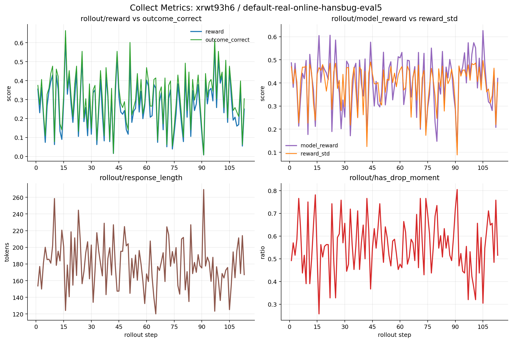
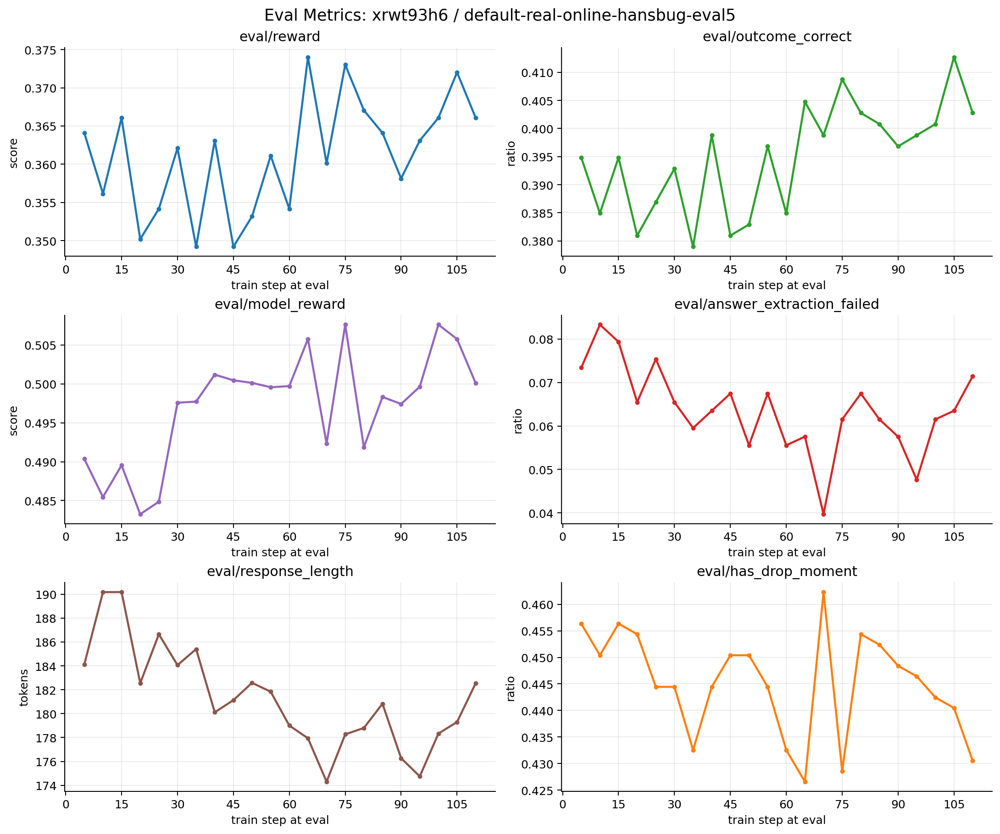
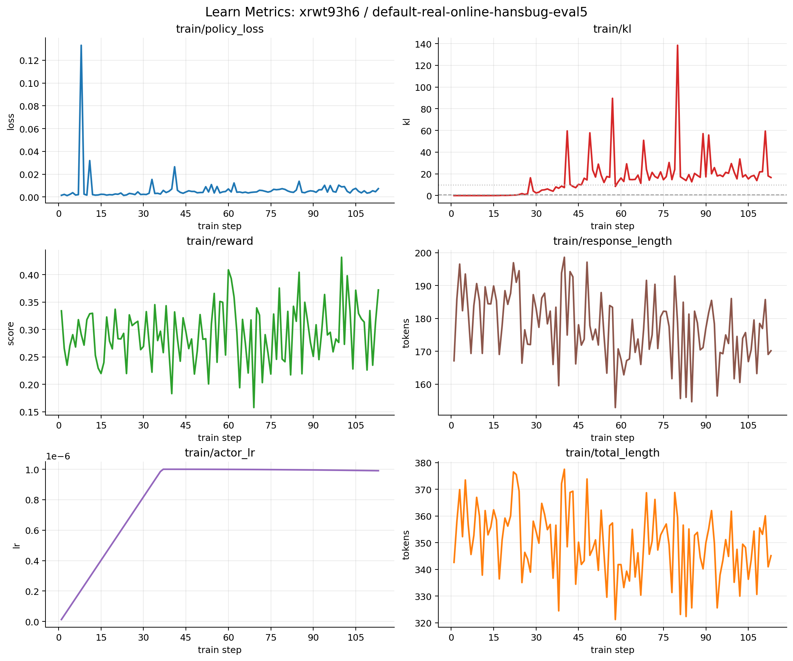
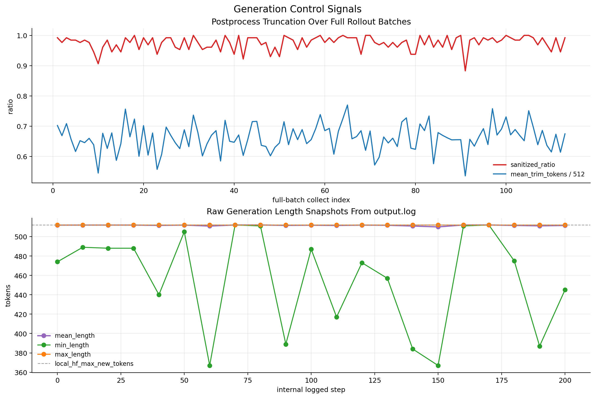
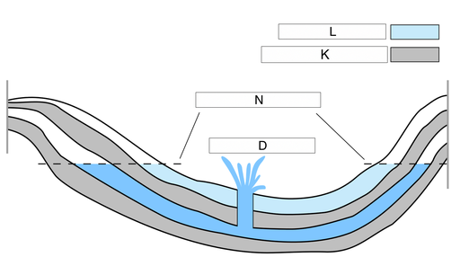

# URSA8B Stage3 实验记录: `xrwt93h6` / `default-real-online-hansbug-eval5`

## 总体目标

- 评估 `URSA-8B + URSA-RM-8B` 在 LightRFT Stage3 真实长跑配置下的训练表现，重点看 `eval/reward`、`eval/outcome_correct`、`train/kl` 与格式/抽取链路是否进入可用区间。
- 确认 `hf separate rollout actor + keep_on_gpu + FSDP` 这一条当前主线配置在长时训练中的行为边界，尤其看 raw generation 是否被真正学会控制，而不是只靠后处理截断。
- 判断这次 run 在人工停止时所处的训练阶段，以及当前最主要的瓶颈是 correctness、proxy gap、KL 漂移，还是长度/格式控制。

## 中间结论

- 这次 run 在 `2026-04-01 19:50:38 +08:00` 被人工停止时，已经跑到 `Episode 1/10` 的 `113/120` 个 collect/train step，约完成首轮 episode 的 `94.17%`；最后一次评估发生在 `train_step=110`。它更像“一次接近跑完整轮的中途截断”，不是早期 smoke run。
- `eval/outcome_correct` 从前 5 次评估均值 `0.3885` 升到后 5 次 `0.4024`，`eval/reward` 从 `0.3581` 升到 `0.3651`。训练没有崩，但提升幅度有限，已经接近平台区。最佳 `eval/reward=0.3740@train_step65`，最佳 `eval/outcome_correct=0.4127@train_step105`。
- 当前主要问题不是 answer extraction，而是“高 KL + 原始生成过长 + correctness 增长慢”。`eval/answer_extraction_failed` 多数在 `4%~7%`；但 `train/kl` 在 `train step 33` 就超过 `10`，在 `step 95` 冲到 `138.46`，同时 raw generation snapshot 的均值几乎始终贴着 `512` token 上限，full-batch 后处理截断比例均值 `97.54%`，最近 20 个 batch 达 `98.28%`。
- 仅有 `seed=42` 这一组，不能据此判断稳定性；本记录只能解释“这一次长跑”的行为，不足以解释“该配方的稳定可复现表现”。

## 后续计划

- 先围绕“让模型自然停住”做一轮小改动复跑，继续记录 `sanitized_ratio`、`mean_trim_tokens` 与 `eval/outcome_correct` 是否同步改善；否则当前 `response_length` 的改善只是在后处理层成立。
- 单独收紧 KL 控制并做至少 3 个 seed，对比 `init_kl_coef` 或 KL 调度策略，避免继续用 correctness 的微弱提升去交换过大的 policy drift。
- 从 `global_step100` checkpoint 续跑或平行开新 run 时，把评估点至少固定到 `step 60/80/100/120`，重点观察 `eval/model_reward - eval/outcome_correct` 的 proxy gap 是否继续扩大。

## 实验记录

本记录因单次实验说明较长且包含多张曲线图，采用“小节结构”替代表格；`实验名称 / 实验设置 / 实验观察 / 实验分析` 四项信息仍完整保留。

### 实验名称

- 实验名：`default-real-online-hansbug-eval5-20260330_235638`
- W&B run：`hansbug/LightRFT-URSA8B-Stage3/xrwt93h6`
- W&B 链接：<https://wandb.ai/hansbug/LightRFT-URSA8B-Stage3/runs/xrwt93h6>
- 实验目的：验证真实长跑 Stage3 配方在接近完整首轮 episode 时的收敛状态、proxy/correctness gap 与长度控制状态。

### 实验设置

- 运行时间：`2026-03-30 23:59:53 +08:00` 启动，`2026-04-01 19:50:38 +08:00` 人工停止，持续约 `43.85` 小时。
- 代码入口：`examples/math_prm/train_colocate.py`
- shell wrapper：当前无法确认；W&B metadata 未显式记录外层壳脚本。
- git commit：`8c779219c8deb4a0ac8c226b6b4039f7071101d0`，主题行为 `fix(strategy): reload keep-on-gpu rollout actor after sync`
- 分支：W&B metadata 未直接记录；本地已确认该 commit 位于 `dev/math_prm_train_working`。
- 模型：actor `URSA-8B`，奖励模型 `URSA-RM-8B`
- 数据：`/data/LightRFT/tmp/ursa_stage3/mmathcot_stage3_math_psgrpo.jsonl`
- 训练设置：`train_batch_size=128`，`micro_train_batch_size=4`，`rollout_batch_size=128`，`micro_rollout_batch_size=4`，`n_samples_per_prompt=8`，`max_samples=15360`
- 优化设置：`actor_learning_rate=1e-6`，`init_kl_coef=0.001`，`advantage_estimator=group_norm`
- rollout / engine：`engine_type=hf`，`hf_separate_rollout_actor=true`，`hf_separate_rollout_keep_on_gpu=true`，`local_hf_max_new_tokens=512`
- 评估设置：`eval_steps=5`，`max_eval_samples=500`，`eval_holdout_size=500`，`eval_holdout_seed=42`，`eval_n_samples_per_prompt=1`，`eval_temperature=0.0`
- 分布式与资源：`FSDP + bf16 + zero_stage=3 + adam_offload`，`8 x NVIDIA A100-SXM4-80GB`
- system prompt：要求每一步以 `Step N:` 开头，并以唯一一行 `†Answer:` 结束
- 随机种子：`seed=42`
- 本地日志：`rft_logs/default-real-online-hansbug-eval5/node0_20260330_235638.log`
- 本地 W&B 目录：`wandb/run-20260330_235953-xrwt93h6`
- 结果目录：`results/default-real-online-hansbug-eval5/default-real-online-hansbug-eval5-ep10-kl0.001-lr1e-6-20260330_235638`
- checkpoint 设置：`save_steps=20`，`max_ckpt_num=2`；人工停止时盘上仅保留 `global_step80` 与 `global_step100`
- 备注：本次 W&B 状态显示为 `failed`，但这是因为用户在 `2026-04-01 19:50:38 +08:00` 手动停止；本记录不把它视为训练异常。

### 实验观察

- W&B history 共记录 `135` 个 row，其中 `113` 个 rollout/train row，`22` 个 eval row；最后一个 rollout/train row 对应第 `113` 个训练步，最后一次评估对应 `train_step=110`。
- 按 `rollout_batch_size=128` 粗略估算，人工停止前已经处理约 `14464` 个训练样本，占本轮 `max_samples=15360` 的 `94.17%`。
- `eval/reward` 在 `0.3490 ~ 0.3740` 间波动；最佳值为 `0.3740@train_step65`，最后一次为 `0.3661@train_step110`。前 5 次评估均值为 `0.3581`，后 5 次为 `0.3651`。
- `eval/outcome_correct` 在 `0.3794 ~ 0.4127` 间波动；最佳值为 `0.4127@train_step105`，最后一次为 `0.4028`。前 5 次评估均值为 `0.3885`，后 5 次为 `0.4024`。
- `eval/model_reward` 从前 5 次均值 `0.4867` 升到后 5 次 `0.5021`；最后一次为 `0.5001`。
- `eval/answer_extraction_failed` 的最小值为 `0.0397@train_step70`，最后一次为 `0.0714`。前 5 次均值 `0.0754`，后 5 次均值 `0.0603`。
- `train/kl` 从 `0.0067@train_step1` 起步，在 `train_step29` 首次超过 `1`，在 `train_step33` 首次超过 `10`，在 `train_step49` 首次超过 `50`，峰值达到 `138.46@train_step95`，最后一次仍为 `16.65`。前 20 步均值 `0.0515`，最后 20 步均值 `21.8143`。
- `train/policy_loss` 从前 20 步均值 `0.0102` 降到最后 20 步 `0.0062`；`train/reward` 从前 20 步均值 `0.2833` 升到最后 20 步 `0.3123`。
- `rollout/reward` 非常噪声，范围 `0.0078 ~ 0.6289`；其中 `0.6289@train_step19` 为最高，`0.0078@train_step109` 为最低。`train_step109~111` 一段出现明显下探，随后在 `train_step113` 回到 `0.25`。
- `rollout/has_drop_moment` 长时间停留在 `0.43 ~ 0.76`，最后一次为 `0.5156`；最后一次评估的 `eval/has_drop_moment` 为 `0.4306`。
- `train/response_length` 从前 20 步均值 `182.96` 降到最后 20 步 `171.76`；`eval/response_length` 从前 5 次均值 `186.73` 降到后 5 次 `178.24`。
- 本地 `output.log` 中一共解析到 `113` 个 full-batch 后处理截断记录；`sanitized_ratio` 的全程均值为 `97.54%`，最近 20 个 batch 的均值为 `98.28%`。
- 同一份 `output.log` 中解析到 `21` 个 raw generation length snapshot；全程 `mean_length` 均值为 `511.58/512`，在 `step130~200` 区间的均值仍有 `511.34/512`。
- 轨迹快照存档存在于 `global_step20/40/60/80/100` 五个时刻；`global_step120` 未生成，因为运行在 `step113` 附近被人工停止。

### 实验分析

- `eval/outcome_correct` 是最值得信任的 holdout 正确率指标，因为它直接回答“模型最后答对了多少题”。这次 run 的提升只有约 `1.4` 个百分点，说明训练确实在推进，但真实 reasoning 改善幅度有限，已经接近平台区。
- `eval/reward` 是带有格式与其它 shaping 的端到端奖励。它和 `eval/outcome_correct` 同向提升，但最佳值出现在 `train_step65`，最后一次没有继续创新高，说明后段训练并没有持续带来新的泛化收益。
- `eval/model_reward` 明显高于 `eval/outcome_correct`，而且后者的提升幅度更小。这意味着奖励模型对某些“格式正确、局部步骤看起来像样”的输出偏乐观，proxy gain 没有等比例转成最终正确率。
- `train/kl` 用来观察当前 actor 相对 reference policy 的偏移程度。它在 `train_step33` 就跨过 `10`，`train_step95` 冲到 `138.46`，说明当前 `init_kl_coef=0.001` 对这条配方的约束明显偏弱。当前 run 更像是在“用很高的 policy drift 去换有限的 reward/correctness 改善”。
- `train/policy_loss` 在下降，但 `train/kl` 长时间处在高位，这个组合更像“高漂移平台期”而不是“低漂移稳定收敛期”。也就是说，优化还在继续，但已经不再以健康的 trust-region 形态前进。
- `eval/answer_extraction_failed` 大多数时候在 `4%~7%`，说明 answer extraction 链路已经基本可用。当前 accuracy 低，不是因为解析器大面积失效，而是因为模型本身仍会给出逻辑或最终答案错误的链条。
- `rollout/has_drop_moment` / `eval/has_drop_moment` 原本是用来看单条推理链中是否出现明显的 step-level 质量回落。它们长期维持在 `0.43 ~ 0.52` 左右，说明很多输出虽然格式完整，但中途 reasoning 仍不稳定。
- `response_length` 在 W&B 曲线上看起来下降了，但 `generation_control.png` 说明 raw generation 的真实长度几乎一直贴着 `512` token 上限；与此同时，后处理在全程平均裁掉 `338.6` token，最近 20 个 batch 平均裁掉 `345.8` token。当前“长度变短”主要是靠后处理截断，不是模型自然学会在 `†Answer:` 后停住。
- `step20` 的样例说明模型很早就能给出格式正确且答对的输出；`step100` 的样例说明即便格式很干净、answer extraction 也不失败，依然可能答错。当前阶段更像“格式脚手架已经立住，稳健正确性还没跟上”。
- 这次记录只有一个 seed，而且运行在首轮 episode 结束前被人工停止，因此不能据此判断跨 seed 稳定性，也不能判断 `train_step120` 之后是否会继续上升或开始回落。
- TODO：优先把“原始生成过长”与“KL 过高”拆开处理，再决定是否保留当前 reward 配方；否则继续堆长跑成本，大概率只会把 proxy 推得更高，而不是把 correctness 真正拉起来。

## 曲线与截图

以下曲线均由 W&B raw history 直接重绘，不做 smoothing，等价于 `Smoothing=0` 的原始观察。

### Collect



- `rollout/reward` 用来看每个 rollout batch 的最终 shaped reward；这次 run 的波动非常大，说明 batch 间质量不稳定。
- `rollout/outcome_correct` 用来看在线采样的即时正确率；它与 `rollout/reward` 同向，但没有形成后段持续抬升。
- `rollout/model_reward` 用来看 RM 视角下的代理质量；它常年高于 `rollout/outcome_correct`，提示 proxy optimism。
- `rollout/has_drop_moment` 用来看链内质量回落；持续高位意味着长链条内部仍常出现中途“掉分”。

### Eval



- `eval/reward` 用来看 holdout 上的端到端奖励；它在 `train_step65` 左右达到最好状态，后段处于平台波动。
- `eval/outcome_correct` 用来看 holdout 真正答对比例；最后一次 `0.4028` 高于前期均值，但距离“明显跃迁”还差一截。
- `eval/model_reward` 用来看 holdout 上的 RM 代理分；它比 `eval/outcome_correct` 更平滑、更乐观。
- `eval/answer_extraction_failed` 用来看抽取链路是否成为主瓶颈；当前数值不低，但已不足以解释 accuracy 的主体问题。
- `eval/response_length` 与 `eval/has_drop_moment` 一起看时，说明回答长度略有下降，但链内稳定性改善不明显。

### Learn



- `train/policy_loss` 用来看 PPO actor 更新量；当前已经降到较低区间。
- `train/kl` 用来看相对 reference 的偏移强度；它过早冲高，是本 run 最大的训练稳定性信号。
- `train/reward` 用来看训练 batch 上即时奖励；它有上升，但幅度不大，且无法抵消 KL 代价。
- `train/response_length` / `train/total_length` 用来看训练输入输出长度变化；表面上看是温和下降。
- `train/actor_lr` 显示 warmup 后很快打满到 `1e-6`，后续维持常数。

### 补充图：Generation Control



- 上半图展示 full-batch 后处理截断比例与平均裁剪 token 数；几乎整个 run 都在高比例截断。
- 下半图展示 `output.log` 中记录的 raw generation length snapshot；均值几乎贴着 `512` token 上限，说明模型本身尚未学会及时停止。

## 轨迹样例

### 样例 A：`global_step20` 的正例



- 事实：该样例 `reward=0.5`，`accuracy_reward[0]=1`，`format_reward[0]=1`，`response_length=130`，`advantage=2.46875`
- 生成摘录：

```text
Step 1: Observe the given image and identify the layers of the aquifer system.
Step 2: Locate the impermeable layer.
Step 3: Identify the labels representing the layers. The labels are K, L, and N.
Step 4: The question asks which label indicates the impermeable layer above the artesian aquifer.
†Answer: N
```

- 解释：这说明模型很早就能满足格式约束，并在一部分样本上给出清晰、正确的短链路答案。

### 样例 B：`global_step100` 的反例


- 事实：该样例 `reward=0.0`，`accuracy_reward[0]=0`，`format_reward[0]=1`，`response_length=60`，`advantage=-0.353515625`
- 生成摘录：

```text
Step 1: Observe the given triangle and the line.
Step 2: Determine the number of intersections between the line and the triangle.
Step 3: Count the number of intersections. There are 0 intersections.
†Answer: 0
```

- 解释：它的格式、长度、answer extraction 都没有明显问题，但最终 correctness 仍然失败，说明当前瓶颈不在格式约束，而在稳定 reasoning 与最终答案选择。

## 信息缺口与稳定性限制

- 当前只有 `seed=42` 一组，缺少规范建议的 `3+` 组 seed 对比，因此所有稳定性结论都只能视作单次 run 分析。
- W&B metadata 记录了入口程序与 commit，但未直接记录外层 shell wrapper 和运行时分支名；这两项仍标记为“未核实”。
- 当前盘上最新 checkpoint 只有 `global_step100`，而人工停止点在 `global_step113` 附近；如果后续需要精确恢复到停止前最后状态，现有产物不足以完全覆盖。

## 附件

- 原始 history 导出：`assets/history_rows.json`
- 运行摘要导出：`assets/run_analysis.json`
- generation-control 解析结果：`assets/generation_control.json`
- 轨迹样例摘要：`assets/trajectory_examples.json`
