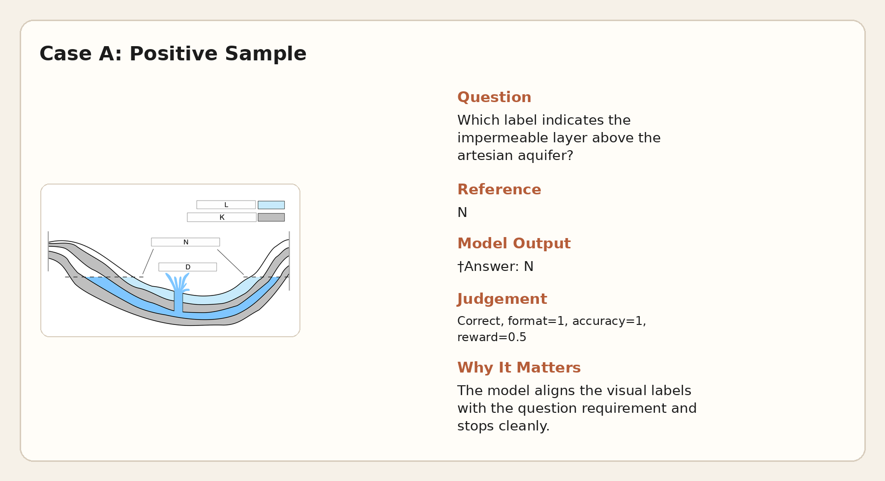
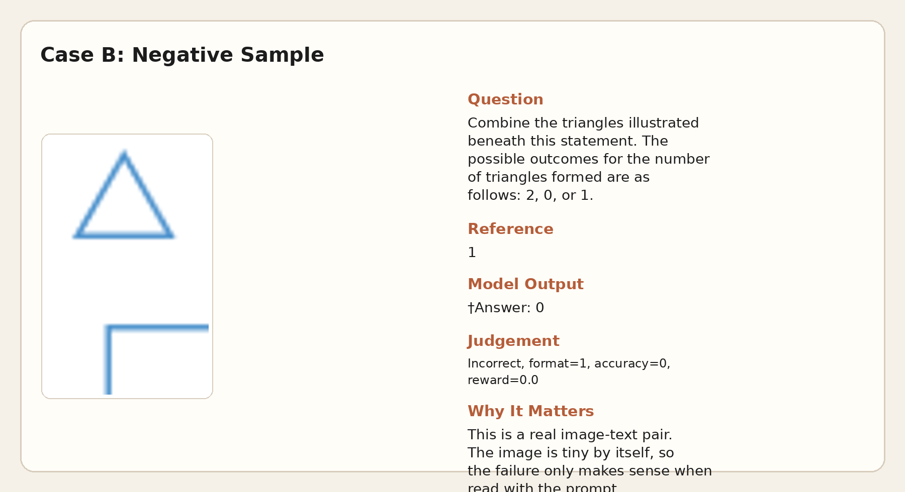

# URSA8B Stage3 实验记录: `xrwt93h6`

## 总体目标

- 验证 `default-real-online-hansbug-eval5` 这条 **真实长跑 Stage3 配方** 到首轮 episode 后段时，`eval/reward`、`eval/outcome_correct` 和 `train/kl` 分别处于什么状态。
- 判断当前训练阶段的主问题到底是 **correctness 不涨**、**KL 漂移过大**，还是 **长度控制主要靠后处理**。

## 中间结论

- **训练进度**：人工停止时已经跑到 **`Episode 1/10` 的 `113/120` step**，约完成首轮 episode 的 **94.17%**；最后一次评估在 **`train_step=110`**。
- **效果有提升，但幅度不大**：`eval/outcome_correct` 从前 5 次评估均值 **0.3885** 升到后 5 次 **0.4024**；`eval/reward` 从 **0.3581** 升到 **0.3651**。最好点分别是 **`0.4127@step105`** 和 **`0.3740@step65`**，整体更像平台期，而不是明显跃迁。
- **当前主问题是 KL 和原始生成长度**：`train/kl` 在 **step 33** 就超过 **10**，在 **step 95** 冲到 **138.46**；与此同时，raw generation 的均值几乎一直贴着 **`512` token 上限**，full-batch 后处理截断比例均值 **97.54%**。
- **当前瓶颈不是 answer extraction**：`eval/answer_extraction_failed` 大多在 **4%~7%**，说明抽取链路不是主要矛盾，主要问题还是 **reasoning correctness** 没有被有效拉起来。
- **结论边界**：这次只有 **`seed=42`** 一组，只能解释这次 run 的行为，**不能**说明该配方跨 seed 的稳定性。

## 后续计划

- 先处理 **“模型不会自然停在 `†Answer:` 后”** 这个问题，再看 correctness 是否同步改善；否则当前长度收敛是假的，只是后处理把长输出切掉了。
- 单独做一轮 **更强 KL 约束** 的对比实验，并补足 **3 个及以上 seed**，判断当前收益是否只是靠过大的 policy drift 换来的。
- 从 **`global_step100`** 续跑或平行新开 run 时，把重点评估点固定在 **60/80/100/120**，继续观察 `eval/model_reward` 和 `eval/outcome_correct` 的偏离是否扩大。

## 实验记录

### 实验名称

- **实验名**：`default-real-online-hansbug-eval5-20260330_235638`
- **W&B run**：`hansbug/LightRFT-URSA8B-Stage3/xrwt93h6`
- **目的**：看真实长跑配置在接近完整首轮 episode 时，是否已经进入“可继续放大训练”的状态。

### 实验设置

- **代码入口**：`examples/math_prm/train_colocate.py`
- **commit**：`8c779219c8deb4a0ac8c226b6b4039f7071101d0`
- **模型**：actor `URSA-8B`，reward model `URSA-RM-8B`
- **数据**：`/data/LightRFT/tmp/ursa_stage3/mmathcot_stage3_math_psgrpo.jsonl`
- **训练配置**：`train_batch_size=128`，`rollout_batch_size=128`，`micro_train_batch_size=4`，`micro_rollout_batch_size=4`，`n_samples_per_prompt=8`
- **优化配置**：`actor_learning_rate=1e-6`，`init_kl_coef=0.001`，`advantage_estimator=group_norm`
- **rollout 配置**：`engine_type=hf`，`hf_separate_rollout_actor=true`，`hf_separate_rollout_keep_on_gpu=true`，`local_hf_max_new_tokens=512`
- **评估配置**：`eval_steps=5`，`max_eval_samples=500`，`eval_holdout_size=500`，`eval_temperature=0.0`
- **硬件**：`8 x A100-SXM4-80GB`
- **日志与结果目录**：
  - `rft_logs/default-real-online-hansbug-eval5/node0_20260330_235638.log`
  - `results/default-real-online-hansbug-eval5/default-real-online-hansbug-eval5-ep10-kl0.001-lr1e-6-20260330_235638`
- **停止方式**：用户手动停止，不作为训练异常分析对象

### 实验观察

#### 1. 训练做到哪里了

- **总时长**：约 **43.85 小时**
- **历史点数**：`135` 个 W&B row，其中 **113 个 rollout/train row**、**22 个 eval row**
- **实际进度**：停止时已经到 **第 113 个训练步**
- **样本规模**：按 `rollout_batch_size=128` 粗估，已处理约 **14464** 个训练样本
- **checkpoint**：盘上只保留 **`global_step80`** 和 **`global_step100`**

#### 2. Eval 表现

- **`eval/outcome_correct`**：范围 **0.3794 ~ 0.4127**，最后一次 **0.4028**
- **`eval/reward`**：范围 **0.3490 ~ 0.3740**，最后一次 **0.3661**
- **`eval/model_reward`**：后 5 次均值 **0.5021**，高于 `eval/outcome_correct`
- **`eval/answer_extraction_failed`**：最低 **0.0397@step70**，最后一次 **0.0714**
- **`eval/response_length`**：前 5 次均值 **186.73**，后 5 次 **178.24**

#### 3. Learn / Rollout 表现

- **`train/kl`**：
  - **step 29** 首次超过 **1**
  - **step 33** 首次超过 **10**
  - **step 49** 首次超过 **50**
  - **step 95** 峰值 **138.46**
  - 最后一次仍有 **16.65**
- **`train/reward`**：前 20 步均值 **0.2833**，后 20 步 **0.3123**
- **`train/policy_loss`**：前 20 步均值 **0.0102**，后 20 步 **0.0062**
- **`rollout/reward`**：波动极大，范围 **0.0078 ~ 0.6289**
- **`rollout/has_drop_moment`**：长期在 **0.43 ~ 0.76** 间波动，最后一次 **0.5156**

#### 4. 长度与后处理

- **表面长度在下降**：`train/response_length` 从前 20 步均值 **182.96** 降到后 20 步 **171.76**
- **但原始生成并没有真正变短**：
  - raw generation snapshot 的 `mean_length` 全程均值 **511.58 / 512**
  - `step130~200` 区间的均值仍有 **511.34 / 512**
- **后处理截断非常重**：
  - full-batch `sanitized_ratio` 全程均值 **97.54%**
  - 最近 20 个 batch 仍有 **98.28%**
  - 平均每次裁掉约 **338.6 token**

### 实验分析

#### 1. 现在处于什么阶段

- 这次 run 已经不是 smoke 阶段，而是 **首轮 episode 的后段长跑**。
- 从 `eval/reward` 和 `eval/outcome_correct` 看，训练 **没有崩**，但也 **没有进入明显加速上升区间**。
- 当前更像 **“还能涨一点，但已经开始平台化”** 的状态。

#### 2. 当前主问题是什么

- **不是 extraction**：`eval/answer_extraction_failed` 虽然不低，但不足以解释 correctness 的主体问题。
- **主要是高 KL + correctness 涨得慢**：模型确实在偏离 reference，但这种偏离没有换来同等量级的 eval 提升。
- **长度问题仍然主要靠截断兜底**：W&B 上看到的长度下降，不能直接解读为“模型学会了简洁收尾”。

#### 3. 为什么说 proxy gap 还在

- `eval/model_reward` 明显高于 `eval/outcome_correct`，而且上升更平滑。
- 这说明奖励模型更容易给“格式正确、局部看起来像样”的输出高分，但这些分数 **没有完整转成最终答对率**。

#### 4. 这次 run 能支持什么、不能支持什么

- **能支持的判断**：这条配方在真实长跑下能稳定跑到 episode 后段，且 eval 指标有小幅提升。
- **不能支持的判断**：它是否跨 seed 稳定、是否值得继续放大训练时长、是否只要继续跑就会自然变好。

## 曲线

### Collect / Eval / Learn


- **Collect** 说明在线采样质量波动很大，batch 间不稳定仍然明显。


- **Eval** 说明 holdout 指标在涨，但涨幅有限，当前更接近平台而不是突破。


- **Learn** 里最危险的信号是 **KL 过早冲高**，不是 `policy_loss` 本身。

### Generation Control


- 这张图最关键：**原始生成长度几乎一直贴着 512 上限**，而且几乎每个 full batch 都要做重截断。

## 图文样例

### 样例 A：正例 pair



- **对应训练步**：`global_step=20`
- **题目**：Which label indicates the impermeable layer above the artesian aquifer?
- **参考答案**：**N**
- **模型输出**：**`†Answer: N`**
- **完整生成文本**：

```text
Step 1: Observe the given image and identify the layers of the aquifer system.  The image shows a cross section of an artesian aquifer system.

Step 2: Locate the impermeable layer. An impermeable layer is one that does not allow water to pass through it.

Step 3: Identify the labels representing the layers. The labels are K, L, and N.  Layer N is the impermeable layer.

Step 4: The question asks which label indicates the impermeable layer above the artesian aquifer.  Label N is the impermeable layer.

†Answer: N
```
- **为什么它是正例**：图中的标签信息和题干要求被正确对齐，模型能给出正确结论并在答案后停住。

### 样例 B：反例 pair



- **对应训练步**：`global_step=100`
- **题目**：Combine the triangles illustrated beneath this statement. The possible outcomes for the number of triangles formed are as follows: 2, 0, or 1.
- **参考答案**：**1**
- **模型输出**：**`†Answer: 0`**
- **完整生成文本**：

```text
Step 1: Observe the given triangle and the line.
Step 2: Determine the number of intersections between the line and the triangle.  The line does not intersect the triangle.
Step 3: Count the number of intersections. There are 0 intersections.
†Answer: 0
```
- **为什么它是反例**：这个样例的 **format 是对的**、`answer extraction` 也没失败，但最终答案仍然错了，所以它反映的是 **reasoning / judgement 错误**，不是格式链路错误。
- **补充说明**：这题本身就是 **图 + 题干一起判断** 的 pair，图本身是个很小的局部图，离开题干单看图片并不能说明问题。

## 附件

- `assets/history_rows.json`
- `assets/run_analysis.json`
- `assets/generation_control.json`
- `assets/trajectory_examples.json`
